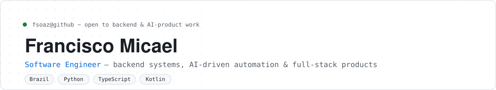
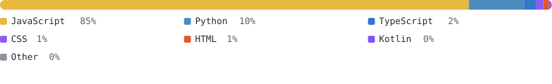

<picture>
  <source media="(prefers-color-scheme: dark)" srcset="assets/banner-dark.svg">
  
</picture>

Software engineer building backend systems, AI-driven automation, and full-stack products end to end — from APIs and data pipelines to the interfaces around them. I favor simple, maintainable solutions over unnecessary complexity, and I ship most projects with tests, CI, and real documentation, not just code.

**[Portfolio ↗](https://fsoaz.github.io/github-page/)** · **[GitHub](https://github.com/fsoaz)**

## Stack

| | |
|---|---|
| **Backend** | Python · FastAPI · PostgreSQL · SQLAlchemy |
| **Frontend** | TypeScript · Next.js |
| **AI / Data** | LLM agents · RAG pipelines · LLM observability & evals · Streamlit |
| **Mobile** | Kotlin · Android (Room, clean architecture) |
| **Delivery** | Docker · GitHub Actions · pytest |

## Featured work

A handful of projects that best represent how I build — the rest is on [github.com/fsoaz](https://github.com/fsoaz?tab=repositories).

<table>
<tr>
<td width="50%" valign="top">

**[Dental Radar](https://github.com/fsoaz/dental-radar)**
B2B sales-intelligence platform that ranks dental clinics by purchase propensity — it answers one question: *which clinics should a salesperson contact first?*
`Python` `FastAPI` `Next.js` `PostgreSQL` `Docker`

</td>
<td width="50%" valign="top">

**[WikiAI](https://github.com/fsoaz/wiki)**
AI-powered encyclopedia MVP built around claim-level citations and verification dates — grounded answers over a public, machine-readable knowledge base, not a black-box chatbot.
`Python` `FastAPI` `Next.js` `PostgreSQL`

</td>
</tr>
<tr>
<td width="50%" valign="top">

**[Financial Market Dashboard](https://github.com/fsoaz/financial-market-dashboard)**
Streamlit app for pulling and visualizing stock, index, and crypto data — returns, volatility, drawdown, and cross-asset correlation, backed by a full test suite and CI.
`Python` `Streamlit` `Plotly` `Docker`

</td>
<td width="50%" valign="top">

**[Trial Reminder](https://github.com/fsoaz/TrialReminderApp)**
Native Android app that tracks free-trial end dates and fires exact, reboot-proof reminders before you get charged.
`Kotlin` `Room` `Clean Architecture`

</td>
</tr>
</table>

## Language mix

Computed from bytes across my public, non-fork repositories — refreshed automatically, not typed by hand.

<picture>
  <source media="(prefers-color-scheme: dark)" srcset="assets/languages-dark.svg">
  
</picture>

## Recently shipped

<!-- RECENT_ACTIVITY:START -->
- **[github-page](https://github.com/fsoaz/github-page)** `HTML` · _today_
- **[dental-radar](https://github.com/fsoaz/dental-radar)** `Python` · _today_
- **[sales-analysis-dashboard](https://github.com/fsoaz/sales-analysis-dashboard)** `Python` · _8d ago_
- **[financial-market-dashboard](https://github.com/fsoaz/financial-market-dashboard)** `Python` · _8d ago_
- **[wiki](https://github.com/fsoaz/wiki)** `Python` · _8d ago_
<!-- RECENT_ACTIVITY:END -->

---

Open to full-time roles, internships, and freelance projects — particularly backend systems, AI-driven products, and automation. Stats on this page are regenerated daily by <a href=".github/workflows/update-stats.yml">a GitHub Action</a> that reads the public GitHub API — see <a href="scripts/generate_stats.py">scripts/generate_stats.py</a>.
